# Relatório de Atrasos (dados tratados)

- Regra de pontualidade: atraso > **15 min** (chegada preferencial; partida como fallback).

## 1) Aeroporto com mais atrasos (geral)
**Destino (chegada):** _TOP_DESTINO_  
**Origem (partida):** _TOP_ORIGEM_

<!-- Mostre os gráficos se existirem -->
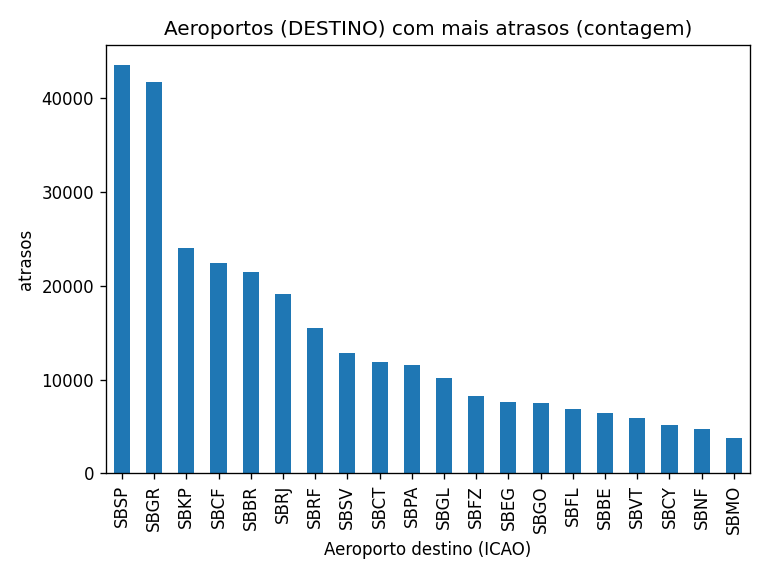
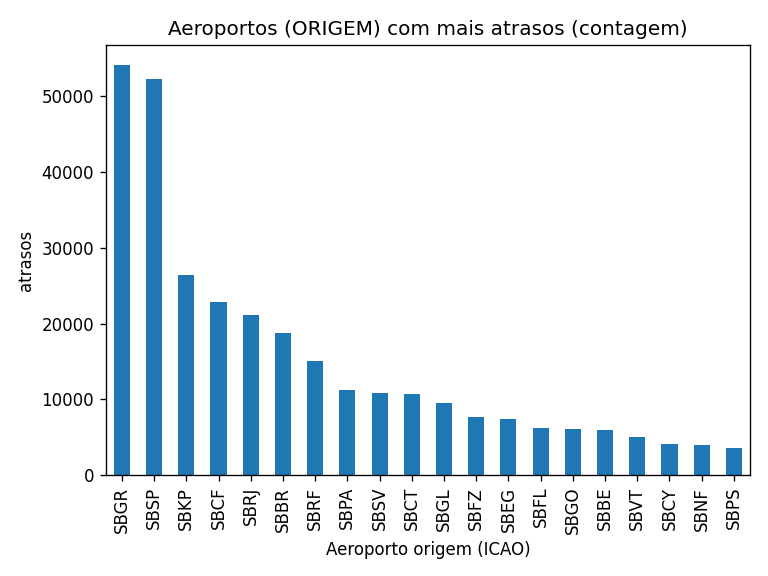

---

## 2) Aeroporto que mais **aumentou** e que mais **diminuiu** atrasos
**Destino – maior aumento:** _DEST_AUM_ | **maior redução:** _DEST_RED_  
**Origem – maior aumento:** _ORI_AUM_  | **maior redução:** _ORI_RED_

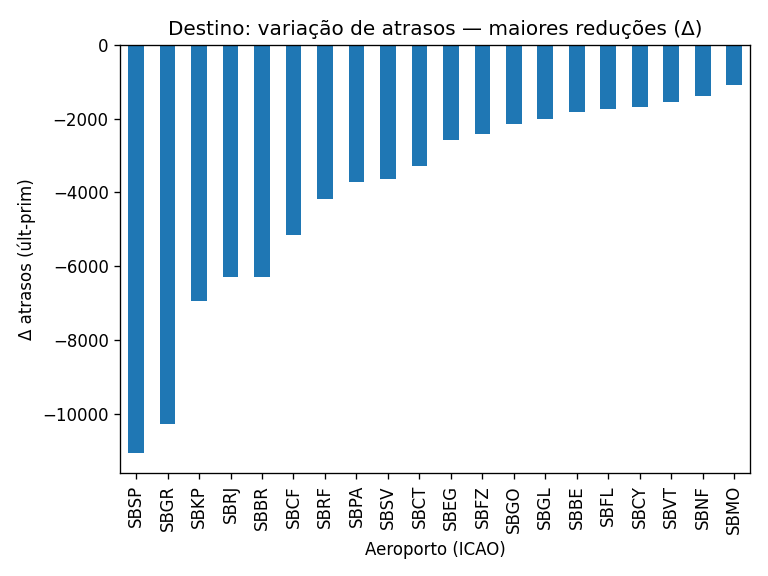
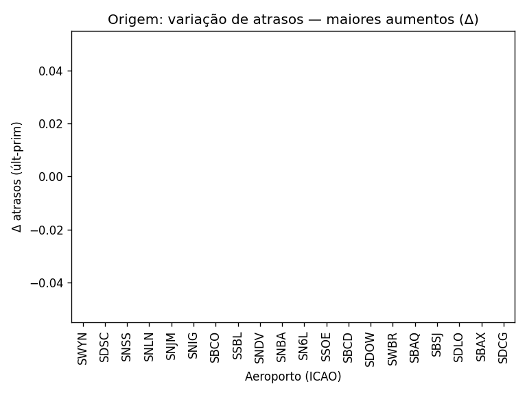
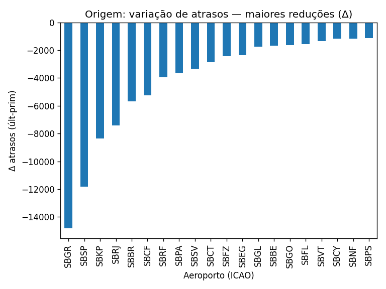

---

## 3) Tendência no período
A taxa de atraso **_SUBIU_OU_DESCEU_** no período analisado.

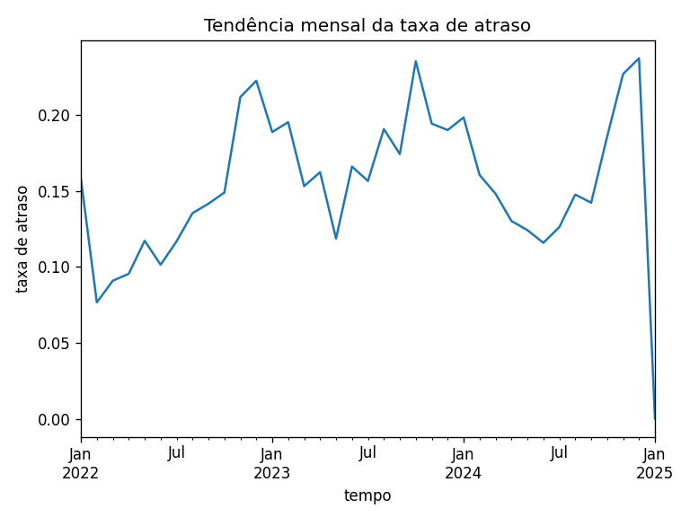

---

## 4) Dias da semana com mais atrasos (por ano)
Abaixo, um PNG por ano (usa **taxa** de atraso; se faltarem dados, cai para **contagem**):

[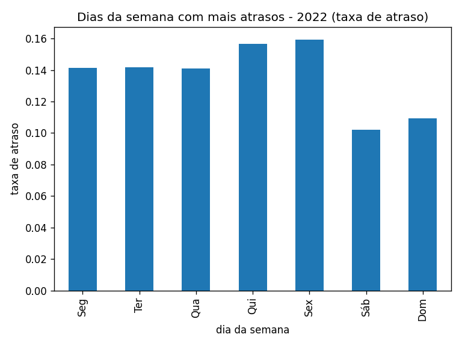](charts/dow_2022.png) [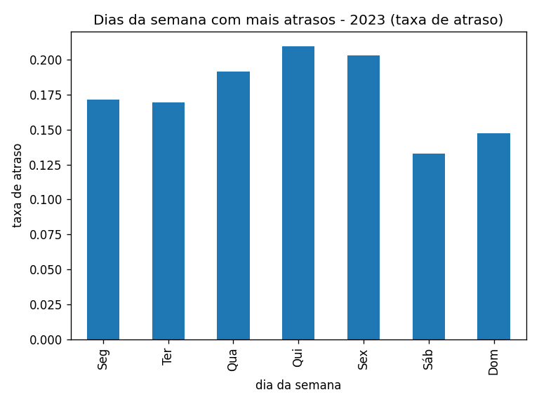](charts/dow_2023.png) [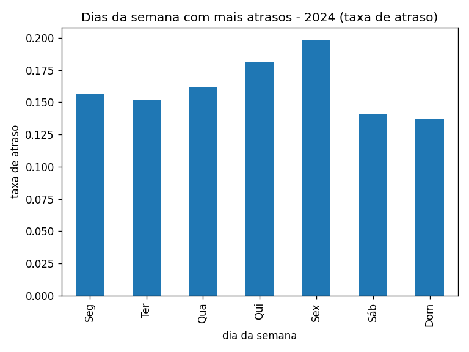](charts/dow_2024.png)
---

## 5) Período do dia com mais atrasos (por ano)
(madrugada, manhã, tarde, noite — taxa; se faltar, contagem)

[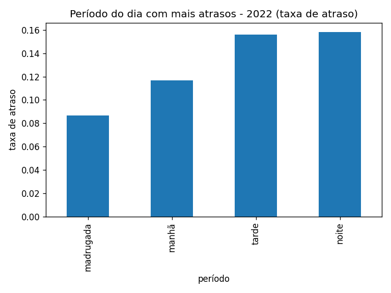](charts/periodo_2022.png) [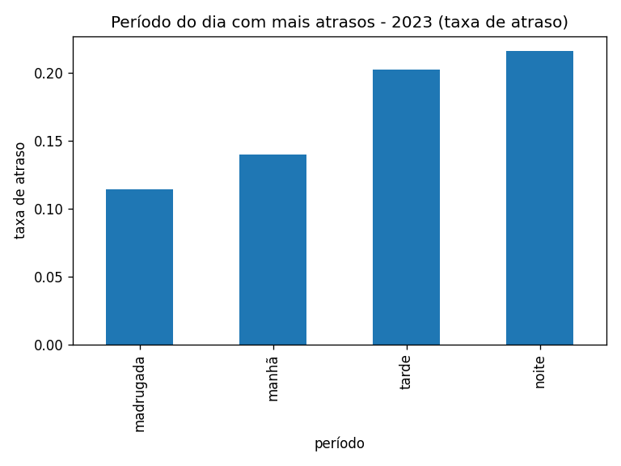](charts/periodo_2023.png) [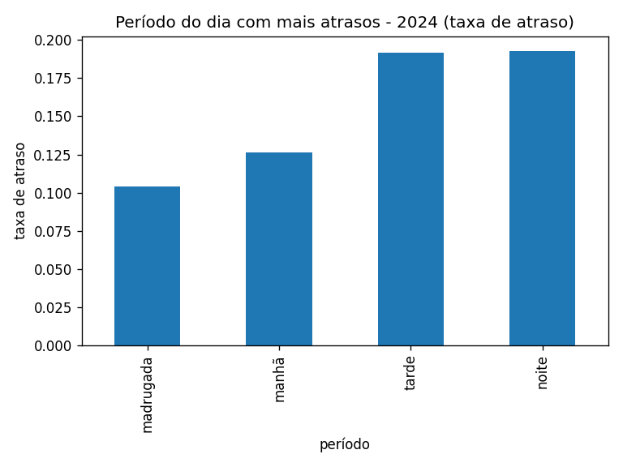](charts/periodo_2024.png)

---

## 6) Companhia que mais atrasa (por ano)
Mostra por **taxa** com `n ≥ mínimo`; se ninguém bater, mostra por **contagem**.

[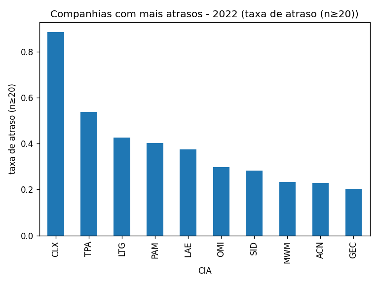](charts/cias_2022.png) [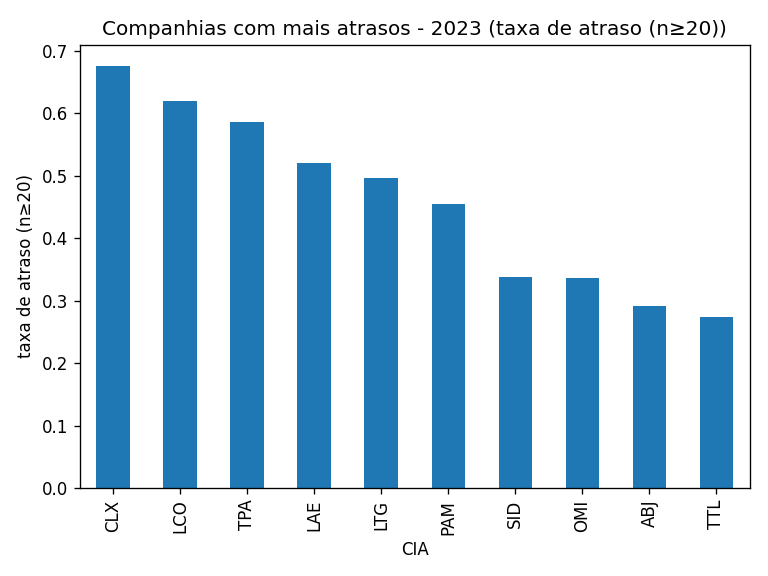](charts/cias_2023.png) [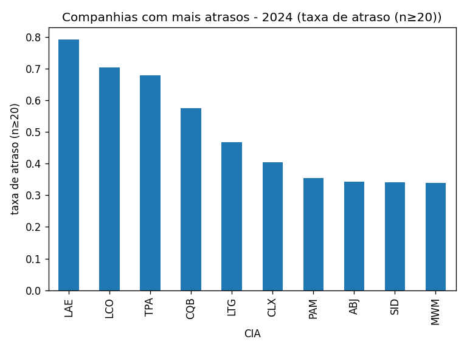](charts/cias_2024.png)
